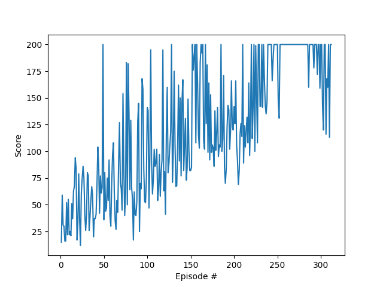

## Reinforcement Training

### CartPole-v0 Pytorch

This is a pytorch implementation for the Cartpole v0 with Policy Gradient. 
CartPole environment is very simple. It has discrete action space (2) and 4 dimensional state space.

#### Scores

#### Results
